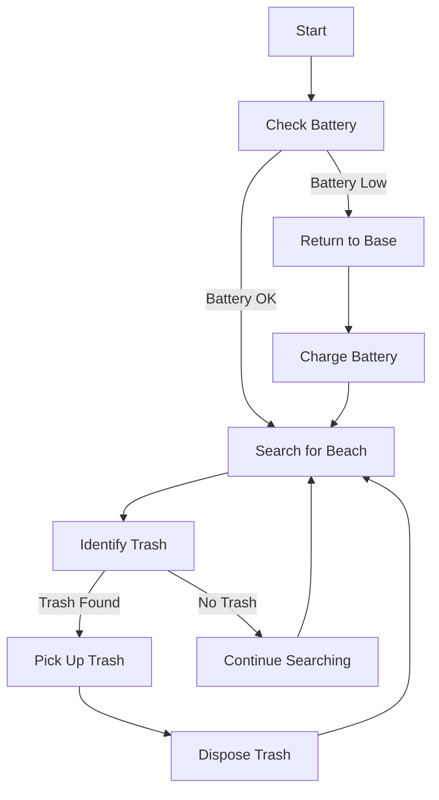

# Flowchart idea for the behaviors

I'm going to make a behavior tree so that the ROSbot that will move through the waypoints and when it detects a person, it will stop and wait for the person to move away to resume the operation.

```tefcha
try
    self localization
except
    2 more attempts
while behavior not success?
    set goal
    while not at goal?
        perception inspection
        if object detection found person?
            FAILURE
            break
        wait for 5s
    if object detection found person?
        FAILURE
    else 
        SUCCESS
        break
next goal
```

---

BT CPP nodes (Please ensure the info below is correct!)

### Control Nodes
- Fallback
- Sequence
- SequenceStar
- Parallel
- ReactiveSequence
- ReactiveFallback
- IfThenElse
- WhileDoElse

### Decorator Nodes
- Inverter
- RetryUntilSuccesful
- RetryUntilSuccessful
- KeepRunningUntilFailure
- Repeat
- Timeout
- Delay
- ForceSuccess
- ForceFailure
- AlwaysSuccess
- AlwaysFailure

### Action Nodes
- SetBlackboard

### Subtree Nodes
- SubTree
- SubTreePlus

### Condition Nodes
- BlackboardCheckInt
- BlackboardCheckDouble
- BlackboardCheckString
- BlackboardCheckBool

### Switch Nodes
- Switch2
- Switch3
- Switch4
- Switch5
- Switch6

---

FUTURE: AI's idea

